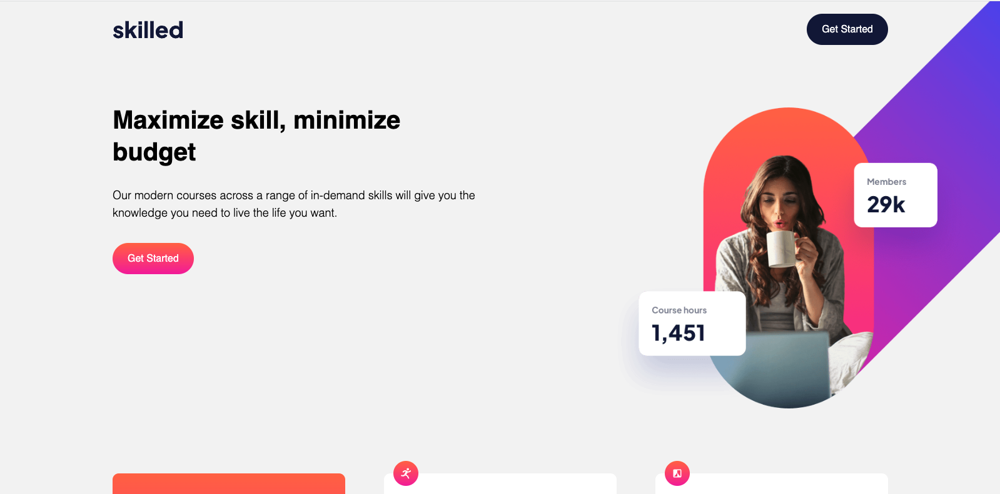
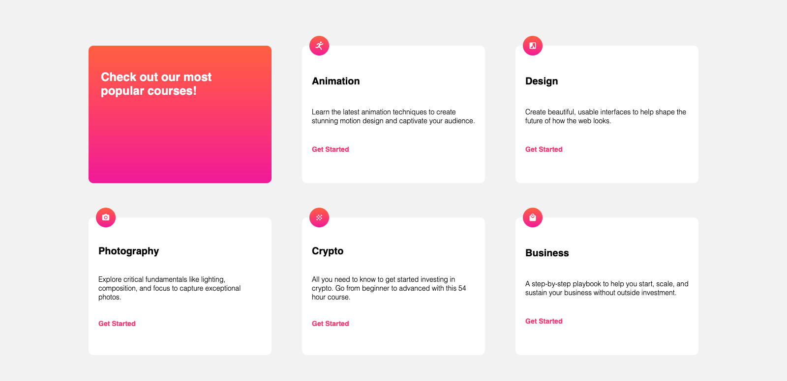
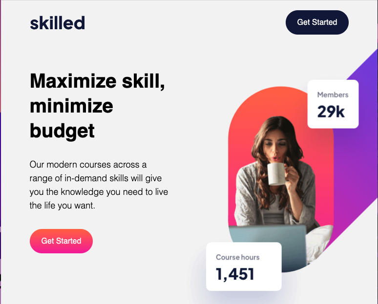
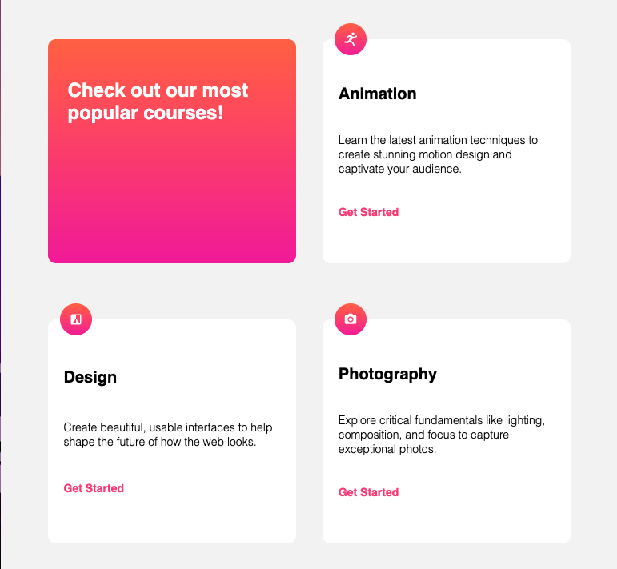
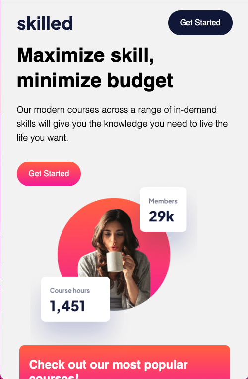
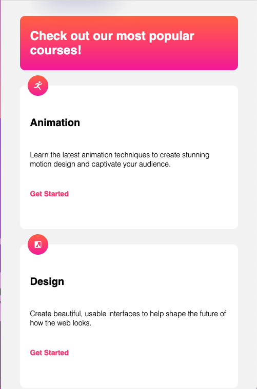

# Frontend Mentor - Skilled e-learning landing page solution

This is a solution to the [Skilled e-learning landing page challenge on Frontend Mentor](https://www.frontendmentor.io/challenges/skilled-elearning-landing-page-S1ObDrZ8q). Frontend Mentor challenges help you improve your coding skills by building realistic projects.

## Table of contents

- [Overview](#overview)
  - [The challenge](#the-challenge)
  - [Screenshot](#screenshot)
  - [Links](#links)
- [My process](#my-process)
  - [Built with](#built-with)
  - [What I learned](#what-i-learned)
  - [Continued development](#continued-development)
  - [Useful resources](#useful-resources)
- [Author](#author)

**Note: Delete this note and update the table of contents based on what sections you keep.**

## Overview

### The challenge

Users should be able to:

- View the optimal layout depending on their device's screen size
- See hover states for interactive elements

### Screenshot

**Desktop**

**Tablet**

**Mobile**

### Links

- Solution URL: [Code](https://github.com/mitchellramsey/skilled-elearning-landing-page)
- Live Site URL: [View Demo](https://mitchellramsey.github.io/skilled-elearning-landing-page/)

## My process

### Built with

- Semantic HTML5 markup
- CSS custom properties
- Flexbox
- CSS Grid

### What I learned

This challenge helped me refresh the basic concepts of flexbox, media queries, and other basic CSS principles. I recently just accepted a new position where I will be working heavily in the front-end development which is not what I do today. This challenge is just helping me get that "ring rust" off so I am coming in with a good mindset in a couple of weeks!

### Continued development

I think I would like to tackle this challenge again as a static React app. There is definitely many spots where I see different components within this layout. 

I would also like to use a different CSS library like SASS.

## Author

- Github - [mitchellramsey](https://github.com/mitchellramsey)
- Frontend Mentor - [@mitchellramsey](https://www.frontendmentor.io/profile/mitchellramsey)
- LinkedIn - [mitchell-ramsey-clt](https://www.linkedin.com/in/mitchell-ramsey-clt/)

